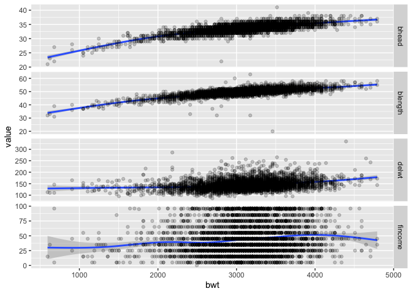
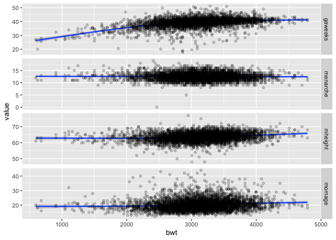
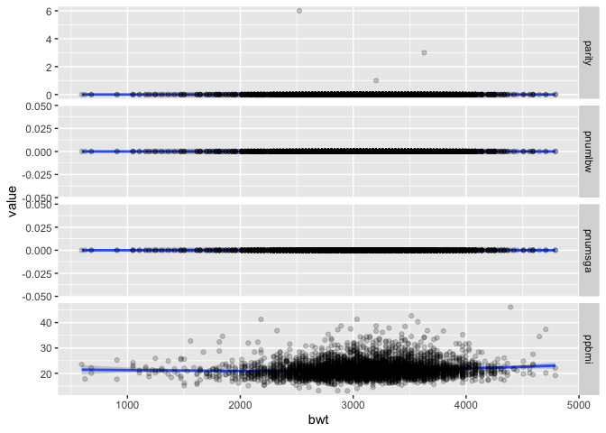
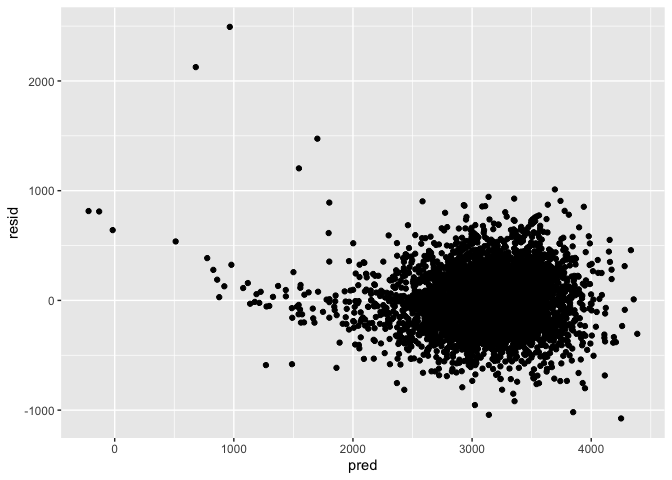
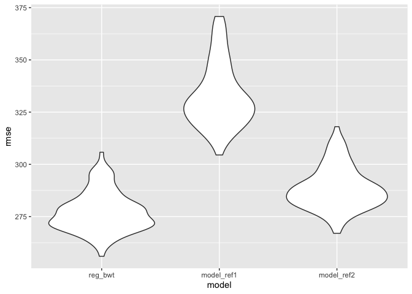
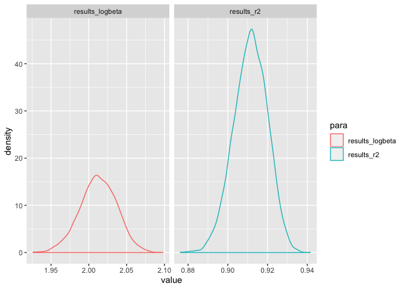

hw6
================
Hao Sun
11/19/2019

## Problem 1

In this problem, you will analyze data gathered to understand the
effects of several variables on a child’s birthweight. This dataset,
available here, consists of roughly 4000 children and includes the
following variables:

babysex: baby’s sex (male = 1, female = 2) bhead: baby’s head
circumference at birth (centimeters) blength: baby’s length at birth
(centimeteres) bwt: baby’s birth weight (grams) delwt: mother’s weight
at delivery (pounds) fincome: family monthly income (in hundreds,
rounded) frace: father’s race (1 = White, 2 = Black, 3 = Asian, 4 =
Puerto Rican, 8 = Other, 9 = Unknown) gaweeks: gestational age in weeks
malform: presence of malformations that could affect weight (0 = absent,
1 = present) menarche: mother’s age at menarche (years) mheigth:
mother’s height (inches) momage: mother’s age at delivery (years)
mrace: mother’s race (1 = White, 2 = Black, 3 = Asian, 4 = Puerto Rican,
8 = Other) parity: number of live births prior to this pregnancy
pnumlbw: previous number of low birth weight babies pnumgsa: number of
prior small for gestational age babies ppbmi: mother’s pre-pregnancy BMI
ppwt: mother’s pre-pregnancy weight (pounds) smoken: average number of
cigarettes smoked per day during pregnancy wtgain: mother’s weight gain
during pregnancy (pounds)

Load and clean the data for regression analysis (i.e. convert numeric to
factor where appropriate, check for missing data,
etc.).

``` r
birthweight = read_csv("./data/birthweight.csv")%>%janitor::clean_names()
```

    ## Parsed with column specification:
    ## cols(
    ##   .default = col_double()
    ## )

    ## See spec(...) for full column specifications.

``` r
race_fctr_lv = c("White", "Black", "Asian", "Puerto Rican", "Other", "Unknown")


birthweight = read_csv("./data/birthweight.csv")%>%janitor::clean_names()%>%
  ###Recode the factors
  mutate(bwt =bwt , 
    babysex = recode_factor(babysex, `1` = "male" , `2` = "female"),
         malform = recode_factor(malform, `1` = "present" , `0` = "absent"),
                frace = forcats::fct_reorder(factor(race_fctr_lv[frace]),frace),
               mrace = forcats::fct_reorder(factor(race_fctr_lv[mrace]),mrace))%>%select(bwt,babysex,mrace,frace,malform,bhead,blength:wtgain)%>%mutate(id=seq(1,4342))
```

    ## Parsed with column specification:
    ## cols(
    ##   .default = col_double()
    ## )
    ## See spec(...) for full column specifications.

``` r
###Have a look on the relationships of birthweight to other variable.
birthweight_vis_1 = birthweight%>% pivot_longer(names_to = "para", values_to = "value" , cols =  bhead:fincome  )
birthweight_vis_2 = birthweight%>% pivot_longer(names_to = "para", values_to = "value" , cols =  gaweeks:momage  )
birthweight_vis_3 = birthweight%>% pivot_longer(names_to = "para", values_to = "value" , cols =  parity:ppbmi  )
birthweight_vis_4 = birthweight%>% pivot_longer(names_to = "para", values_to = "value" , cols =  ppwt:id  )


birthweight_vis_1%>%ggplot(aes(x=bwt,y = value))+geom_smooth()+geom_point(alpha = 0.2)+facet_grid(rows = "para",scales = "free",space = "fix")
```

    ## `geom_smooth()` using method = 'gam' and formula 'y ~ s(x, bs = "cs")'

<!-- -->

``` r
birthweight_vis_2%>%ggplot(aes(x=bwt,y = value))+geom_smooth()+geom_point(alpha = 0.2)+facet_grid(rows = "para",scales = "free",space = "fix")
```

    ## `geom_smooth()` using method = 'gam' and formula 'y ~ s(x, bs = "cs")'

<!-- -->

``` r
birthweight_vis_3%>%ggplot(aes(x=bwt,y = value))+geom_smooth()+geom_point(alpha = 0.2)+facet_grid(rows = "para",scales = "free",space = "fix")
```

    ## `geom_smooth()` using method = 'gam' and formula 'y ~ s(x, bs = "cs")'

<!-- -->

``` r
birthweight_vis_4%>%ggplot(aes(x=bwt,y = value))+geom_smooth()+geom_point(alpha = 0.2)+facet_grid(rows = "para",scales = "free",space = "fix")
```

    ## `geom_smooth()` using method = 'gam' and formula 'y ~ s(x, bs = "cs")'

<!-- -->

Propose a regression model for birthweight. This model may be based on a
hypothesized structure for the factors that underly birthweight, on a
data-driven model-building process, or a combination of the two.
Describe your modeling process and show a plot of model residuals
against fitted values – use add\_predictions and add\_residuals in
making this plot.

**Answer** By looking at the scatterpoint graph of birthweight vs other
indicators, a selection of indicators was chosen. Besides, family income
was included as there is research suggesting family income is correlated
with
    birthweight

``` r
colnames(birthweight)
```

    ##  [1] "bwt"      "babysex"  "mrace"    "frace"    "malform"  "bhead"   
    ##  [7] "blength"  "delwt"    "fincome"  "gaweeks"  "menarche" "mheight" 
    ## [13] "momage"   "parity"   "pnumlbw"  "pnumsga"  "ppbmi"    "ppwt"    
    ## [19] "smoken"   "wtgain"   "id"

``` r
reg_bwt <- lm(bwt~blength+fincome+gaweeks+wtgain+bhead*babysex+mrace+frace,data = birthweight)

reg_bwt%>%summary()
```

    ## 
    ## Call:
    ## lm(formula = bwt ~ blength + fincome + gaweeks + wtgain + bhead * 
    ##     babysex + mrace + frace, data = birthweight)
    ## 
    ## Residuals:
    ##      Min       1Q   Median       3Q      Max 
    ## -1075.67  -185.36    -6.23   181.69  2492.84 
    ## 
    ## Coefficients:
    ##                       Estimate Std. Error t value Pr(>|t|)    
    ## (Intercept)         -5972.3692   131.1078 -45.553  < 2e-16 ***
    ## blength                78.0770     2.0340  38.385  < 2e-16 ***
    ## fincome                 0.4503     0.1774   2.538 0.011193 *  
    ## gaweeks                10.6292     1.4817   7.174 8.56e-13 ***
    ## wtgain                  3.7183     0.3947   9.420  < 2e-16 ***
    ## bhead                 140.2790     4.3091  32.554  < 2e-16 ***
    ## babysexfemale         395.8767   177.7226   2.227 0.025965 *  
    ## mraceBlack           -180.7483    48.2543  -3.746 0.000182 ***
    ## mraceAsian           -112.3103    75.1343  -1.495 0.135042    
    ## mracePuerto Rican     -94.6546    45.7849  -2.067 0.038758 *  
    ## fraceBlack             66.0428    48.3262   1.367 0.171820    
    ## fraceAsian             35.1979    71.8740   0.490 0.624359    
    ## fracePuerto Rican     -19.2588    45.4354  -0.424 0.671680    
    ## bhead:babysexfemale   -10.7295     5.2788  -2.033 0.042156 *  
    ## ---
    ## Signif. codes:  0 '***' 0.001 '**' 0.01 '*' 0.05 '.' 0.1 ' ' 1
    ## 
    ## Residual standard error: 276.8 on 4314 degrees of freedom
    ##   (14 observations deleted due to missingness)
    ## Multiple R-squared:  0.7089, Adjusted R-squared:  0.708 
    ## F-statistic: 808.1 on 13 and 4314 DF,  p-value: < 2.2e-16

``` r
birthweight_rp <-birthweight%>%modelr::add_residuals(reg_bwt)%>%modelr::add_predictions(reg_bwt)

birthweight_rp%>%ggplot(aes(x=pred,y=resid))+geom_point()
```

    ## Warning: Removed 14 rows containing missing values (geom_point).

<!-- -->

Compare your model to two others:

One using length at birth and gestational age as predictors (main
effects only)

``` r
model_ref1<-birthweight%>%lm(bwt~gaweeks+blength ,data = .)
model_ref1%>%summary()
```

    ## 
    ## Call:
    ## lm(formula = bwt ~ gaweeks + blength, data = .)
    ## 
    ## Residuals:
    ##     Min      1Q  Median      3Q     Max 
    ## -1709.6  -215.4   -11.4   208.2  4188.8 
    ## 
    ## Coefficients:
    ##              Estimate Std. Error t value Pr(>|t|)    
    ## (Intercept) -4347.667     97.958  -44.38   <2e-16 ***
    ## gaweeks        27.047      1.718   15.74   <2e-16 ***
    ## blength       128.556      1.990   64.60   <2e-16 ***
    ## ---
    ## Signif. codes:  0 '***' 0.001 '**' 0.01 '*' 0.05 '.' 0.1 ' ' 1
    ## 
    ## Residual standard error: 333.2 on 4339 degrees of freedom
    ## Multiple R-squared:  0.5769, Adjusted R-squared:  0.5767 
    ## F-statistic:  2958 on 2 and 4339 DF,  p-value: < 2.2e-16

One using head circumference, length, sex, and all interactions
(including the three-way interaction) between
these

``` r
model_ref2<-birthweight%>%lm(bwt~blength+bhead+babysex+blength*bhead+babysex*blength+bhead*babysex+blength*bhead*babysex,data = .)
model_ref2%>%summary()
```

    ## 
    ## Call:
    ## lm(formula = bwt ~ blength + bhead + babysex + blength * bhead + 
    ##     babysex * blength + bhead * babysex + blength * bhead * babysex, 
    ##     data = .)
    ## 
    ## Residuals:
    ##      Min       1Q   Median       3Q      Max 
    ## -1132.99  -190.42   -10.33   178.63  2617.96 
    ## 
    ## Coefficients:
    ##                               Estimate Std. Error t value Pr(>|t|)    
    ## (Intercept)                 -7176.8170  1264.8397  -5.674 1.49e-08 ***
    ## blength                       102.1269    26.2118   3.896 9.92e-05 ***
    ## bhead                         181.7956    38.0542   4.777 1.84e-06 ***
    ## babysexfemale                6374.8684  1677.7669   3.800 0.000147 ***
    ## blength:bhead                  -0.5536     0.7802  -0.710 0.478012    
    ## blength:babysexfemale        -123.7729    35.1185  -3.524 0.000429 ***
    ## bhead:babysexfemale          -198.3932    51.0917  -3.883 0.000105 ***
    ## blength:bhead:babysexfemale     3.8781     1.0566   3.670 0.000245 ***
    ## ---
    ## Signif. codes:  0 '***' 0.001 '**' 0.01 '*' 0.05 '.' 0.1 ' ' 1
    ## 
    ## Residual standard error: 287.7 on 4334 degrees of freedom
    ## Multiple R-squared:  0.6849, Adjusted R-squared:  0.6844 
    ## F-statistic:  1346 on 7 and 4334 DF,  p-value: < 2.2e-16

Make this comparison in terms of the cross-validated prediction error;
use crossv\_mc and functions in purrr as appropriate.

``` r
cv_df = 
  crossv_mc(birthweight, 100)

cv_df = 
  cv_df %>% 
  mutate(reg_bwt  = map(train, ~lm(bwt~blength+fincome+gaweeks+wtgain+bhead*babysex+mrace+frace,data = .)),
         model_ref1  = map(train, ~lm(bwt~gaweeks+blength ,data = .)),
         model_ref2  = map(train, ~lm(bwt~blength+bhead+babysex+blength*bhead+babysex*blength+bhead*babysex+blength*bhead*babysex,data = .)))%>% 
  mutate(rmse_reg_bwt = map2_dbl(reg_bwt, test, ~rmse(model = .x, data = .y)),
         rmse_model_ref1 = map2_dbl(model_ref1, test, ~rmse(model = .x, data = .y)),
         rmse_model_ref2 = map2_dbl(model_ref2, test, ~rmse(model = .x, data = .y)))


cv_df %>% 
  select(starts_with("rmse")) %>% 
  pivot_longer(
    everything(),
    names_to = "model", 
    values_to = "rmse",
    names_prefix = "rmse_") %>% 
  mutate(model = fct_inorder(model)) %>% 
  ggplot(aes(x = model, y = rmse)) + geom_violin()
```

<!-- -->

Note that although we expect your model to be reasonable, model building
itself is not a main idea of the course and we don’t necessarily expect
your model to be “optimal”. **Answer** As it occured, the model
construsted by me outperform the two given model as it have less
cross-validated prediction error

### Problem 2

For this problem, we’ll use the 2017 Central Park weather data that
we’ve seen elsewhere. The code chunk below (adapted from the course
website) will download these data.

``` r
weather_df = 
  rnoaa::meteo_pull_monitors(
    c("USW00094728"),
    var = c("PRCP", "TMIN", "TMAX"), 
    date_min = "2017-01-01",
    date_max = "2017-12-31") %>%
  mutate(
    name = recode(id, USW00094728 = "CentralPark_NY"),
    tmin = tmin / 10,
    tmax = tmax / 10) %>%
  select(name, id, everything())
```

    ## Registered S3 method overwritten by 'crul':
    ##   method                 from
    ##   as.character.form_file httr

    ## Registered S3 method overwritten by 'hoardr':
    ##   method           from
    ##   print.cache_info httr

    ## file path:          /Users/haosun/Library/Caches/rnoaa/ghcnd/USW00094728.dly

    ## file last updated:  2019-09-26 10:25:25

    ## file min/max dates: 1869-01-01 / 2019-09-30

The boostrap is helpful when you’d like to perform inference for a
parameter / value / summary that doesn’t have an easy-to-write-down
distribution in the usual repeated sampling framework. We’ll focus on a
simple linear regression with tmax as the response and tmin as the
predictor, and are interested in the distribution of two quantities
estimated from these data:

r̂2 log(β̂0∗β̂1)

Use 5000 bootstrap samples and, for each bootstrap sample, produce
estimates of these two quantities. Plot the distribution of your
estimates, and describe these in words.

``` r
boot_straps = 
  weather_df %>% 
  modelr::bootstrap(n = 5000)

logbeta = function(df){log(df[[1,2]]*df[[2,2]])}
rsquare = function(df){pull(df,"r.squared")}

bs_result = boot_straps%>%
mutate(
    models = map(strap, ~lm(tmax ~ tmin, data = .x) ))

bs_result=bs_result %>%mutate(
    result =  map(models, broom::tidy),
    results_logbeta = map_dbl(result, logbeta),
   results_r2 = map(models, broom::glance),
    results_r2 = map_dbl(results_r2,.%>%pull(r.squared)))
    
  

bs_result=bs_result%>%select(-strap,-models,-result)
bs_result%>%pivot_longer(names_to = "para", values_to = "value", cols = results_logbeta:results_r2)%>%
  ggplot()+geom_density(aes(x = value ,color = para) )+facet_grid(~para,scales = "free")
```

<!-- -->

Using the 5000 bootstrap estimates, identify the 2.5% and 97.5%
quantiles to provide a 95% confidence interval for r̂2 and log(β̂0∗β̂1)

**Answer** The 95% confidence interval for log(β̂0∗β̂1) is as followed

``` r
pull(bs_result,results_logbeta)%>%quantile( probs = c(2.5,97.5)/100)
```

    ##     2.5%    97.5% 
    ## 1.962783 2.059198

The 95% confidence interval for r̂^2 is as followed

``` r
pull(bs_result,results_r2)%>%quantile( probs = c(2.5,97.5)/100)
```

    ##      2.5%     97.5% 
    ## 0.8941972 0.9270537
